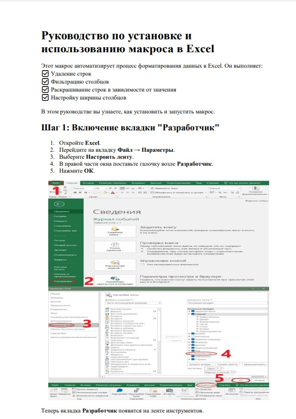
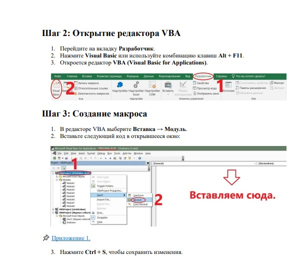
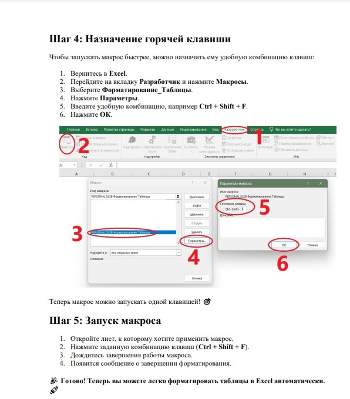

## Данный макрос выполняет автоматизацию в таблицах формата iiko
# 📄 Инструкция

## 📌 [Приложение 1.](https://github.com/olodenm/ako/blob/formatting_tables_vba/macro)

#### Подробная инструкция  ***[здесь](https://github.com/olodenm/ako/blob/formatting_tables_vba/macros.pdf)***
